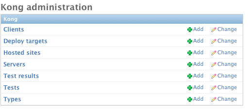
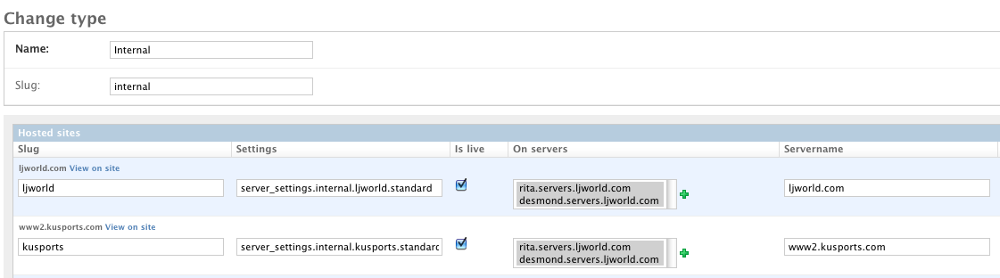
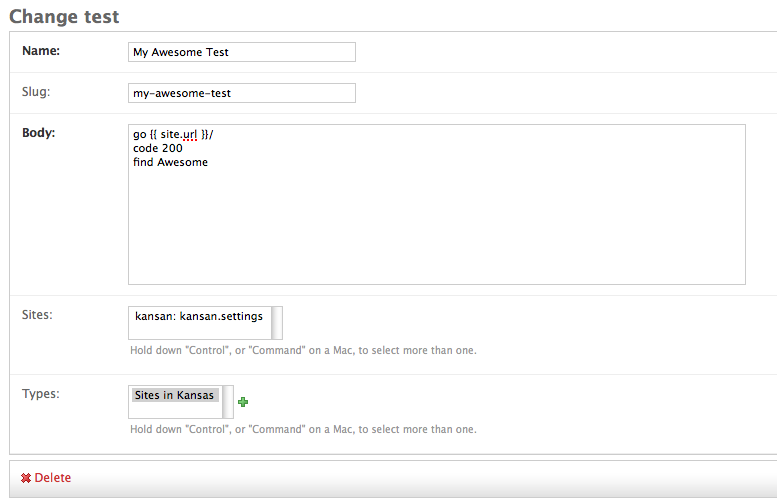
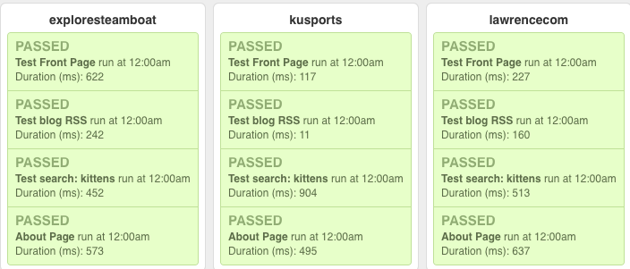

Overview
========

Getting Started
---------------

At work we have to manage a ton of Django based sites. Just for our World Company sites, we have over 50 different settings files, and this doesn't take into account the sites that we host for other clients. At this size it becomes basically impossible to test each site in a browser when you push things to production. To solve this problem I have written a very basic server description tool. This allows you to describe sites (settings file, python path, url, etc.) and servers.

On top of this base, I have written a way to run tests against these sites. You can categorize the sites by the type of site they are (We have Marketplace, ported Ellington, and old Ellington sites). This allows you to run tests against different types of sites. You may also have custom applications that run on only one or two certain domains. You can specify specific sites for tests to be run against as well.

The tests are written in `Twill <http://twill.idyll.org/commands.html>`_, which is a simple Python DSL for testing. Twill was chosen because it is really simple, and does functional testing well. The twill tests are actually rendered as Django templates, so you get the site that you are testing against in the context. A simple example that tests the front page of a site is as follows::

    go {{ site.url }}
    code 200
    find "Latest News"

This simply loads the Site's front page, checks that the status code was 200, and checks that the string Latest News is on that page. The arguments to find are actually a regex, allowing for lots of power in checking for content.

The interface for this in the Admin is pretty simple.

You can see that this Test will run against any of the Sites that we have defined in the "Sites in Kansas" Type.

This then gives you the ability to view all of the results for your tests in a web interface. Below is an example of the live view that I see when looking at our servers. We have only just started using Kong, but the tests it provides are really useful to make sure that functionality works after a deployment.

You can also see the history of a test on a site. Currently it shows the last 15 results, but paginating this page will be easy. It allows you to see if your test has been running well over time. Another nice thing is that it measures the Duration of the test, so that you can see if it is going slow or fast.

.. image:: _static/Site%20Result.png

As you can see, the data display is really basic. It will be improved, but currently its basically the "simplest thing that could possibly work".

Using it yourself
-----------------

When we deploy code changes, I generally run the Kong tests against our sites, making sure that things work. When we launch something new, I will write a kong test to exercise it across all sites. The tests usually take a minute to write, and save lots of time and heart ache, knowing all the sites work.

At the moment the tests can be kicked off by a django management command. The `check_sites` command will allow you to run all of the tests for a given Type or Test. Allowing you to run all of the Ellington tests across all sites, or just run one test across all sites.

..
     django-admin.py check_sites --type ellington
     django-admin.py check_sites --test test-front-page

We currently have this wired up to a cron job that runs every 10 minutes. If you set the `KONG_MAIL_MANAGERS` settings to True, it will send an email to the site managers on a test failure. At some point in the future, I will be integrating Kong into Nagios, so that Nagios will handle the running and alerting of errors. That is eventually the way that it will be run.

There are a lot of ways that this can be improved, however in it's current state it works for me. I figured releasing it will allow anyone who needs something like this to be able to use it. There is no documentation or tests, which will be fixed soon! The web display can also be improved a ton, and that is a high priority as well.

